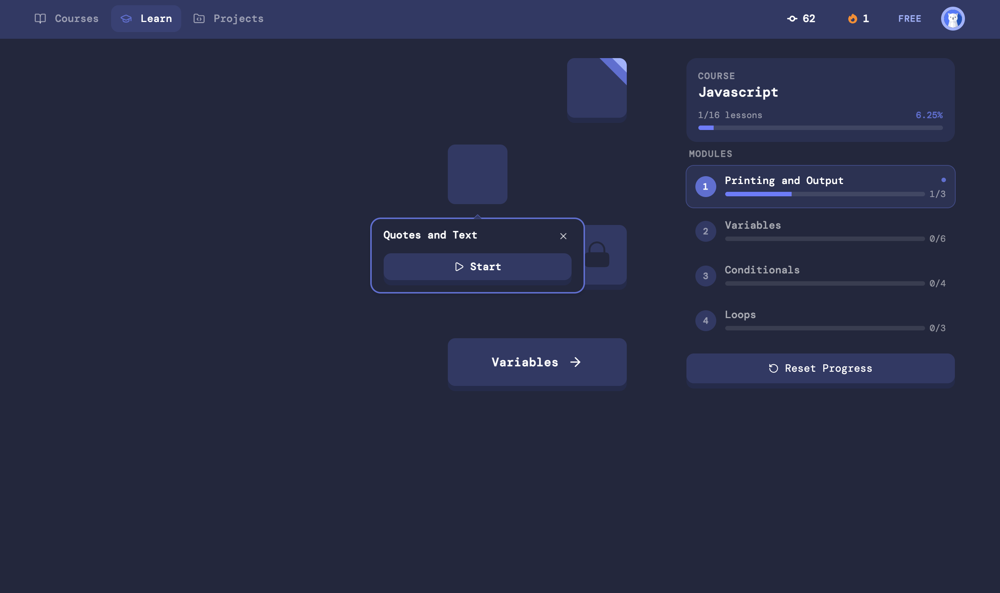
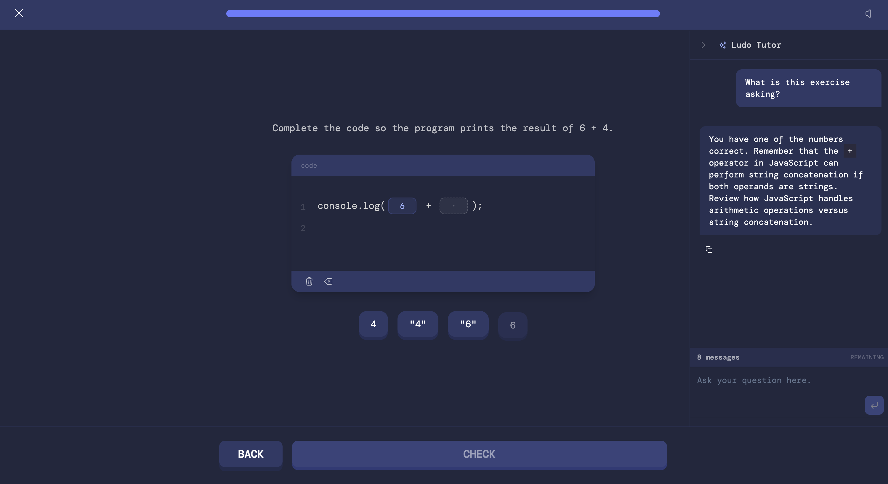
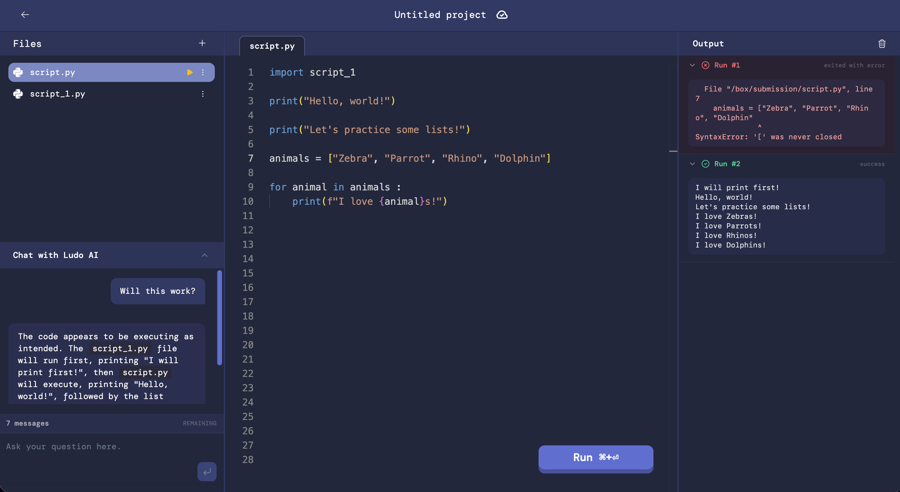
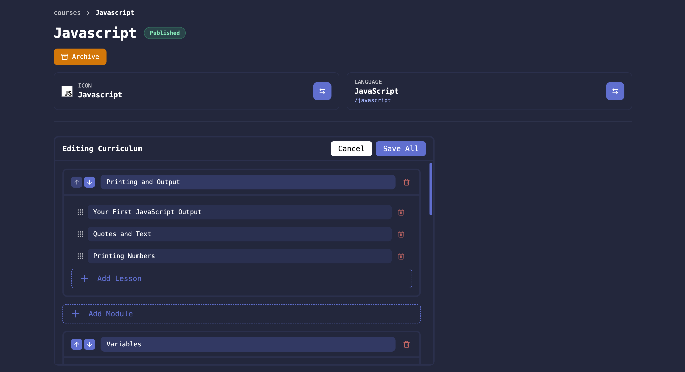
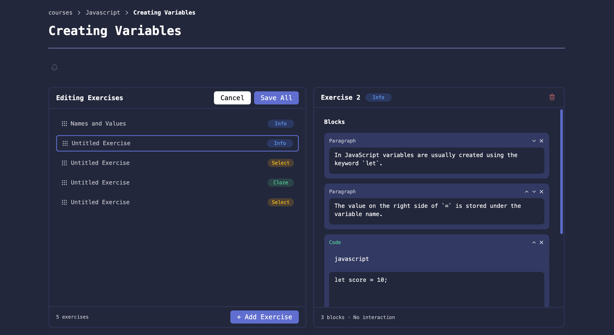

# LudoCode Frontend

## Table of Contents

1. [Overview](#overview)
2. [Running the project](#running-the-project-locally)
3. [Features](#features)
4. [Screenshots](#screenshots)
4. [Attributions](#attributions)
5. [Naming & Trademark](#naming--trademark)

## Overview

This repository contains the frontend code for Ludocode, an open source code learning website.

The project is written using React, Typescript, Tailwind CSS, ShadCN UI, and Tanstack query, form, & router. On the backend, the project uses Kotlin & PostgreSQL.

## Running the project locally

This project is made so that you can run it locally without needing to provide any credentials. For setup instructions on running the project locally & enabling features, see the web docs: https://ludocode.dev/docs

## Core Features

### 📘 Interactive Lessons
- Interactive exercises with multiple formats
- In-editor guided lessons with sandboxed code execution & output validation
- Ability to have multiple courses & lessons
- Streaks, points, & progress tracking

### 💻 Code Execution & Editor
- In-browser WebSocket-based code editor with multiple languages
- Configurable code execution engine for backend execution
- Device-aware "Desktop Only" guard for editor-heavy pages

### 📚 Course Creation & Management
- Create & modify courses via WYSIWYG editor while preserving user progress
- Create courses using YAML with a defined schema
- Ability to archive published courses

### ✨ AI Integration
- Configurable, context-aware AI assistant in lessons & projects

### 🌐 Social
- Share, like, & duplicate projects
- User profiles

### 🔐 Authentication
- Firebase authentication (email, Google, GitHub)
- Optional demo-mode authentication (no Firebase required)
- Account deletion & logout

### 📢 Platform Features
- Animations with Framer Motion & Lottie
- Configurable banner system
- Onboarding flows for new users
- Responsive UI for desktop & mobile

### ⚙️ Architecture
- Cached server state via TanStack Query
- Batched fetching using batshit
- Form handling with Zod & TanStack Form

## Screenshots

### Learn page

### Exercise

### Code Editor

### Course Editor

### Exercise Editor

## Naming & Trademark

"Ludocode" is a trademark of the Ludocode project.

The source code in this repository is open source and can be used, modified, and even commercialized.

If you build a commercial product or hosted service based on this project, please use a different name and branding so it is not confused with the official Ludocode project.

## Attributions

This project uses assets from the LottieFiles Community for animations under the Lottie Simple License.

- Lesson complete trophy animation: Mahendra Bhunwal
  - https://lottiefiles.com/mahendra
