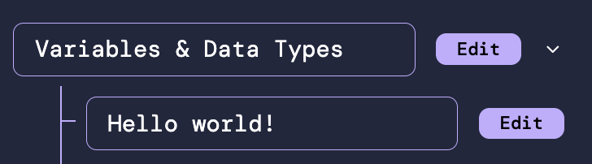
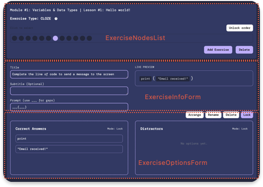
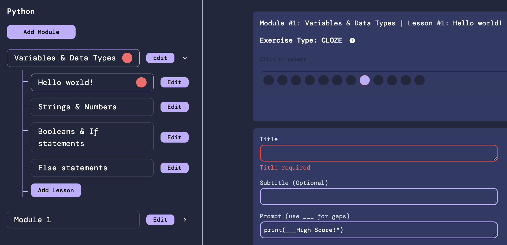

<h1 align="center">The Builder</h1>

## Overview

This document explains how the builder feature, which allows users to edit a courses modules, lessons, exercises, and options, works. It also explains some of the architectural decisions related to the builder.

## Purpose

The purpose of the builder is to provide an intuitive and easy way to edit courses and their content. Without the builder, courses would need to be made by manually editing database entries, and this gets difficult especially when UUIDs and versions are introduced. The builder also enforces schema constraints with visual feedback, so the editing user can clearly see where they have attempted to create an invalid entry in the catalog.

## Architecture Explanation

The component structure for the builder is quite onorthodox, as the nature of Tanstack Form makes it so higher order components are preferred over context. This created some issues given the deeply nested nature of a course. For this reason, I have opted to keep the components big. 

Nevertheless, I went with Tanstack Form due to its type & validation safety, which I decided was more important for updating an entire course at once.

## Snapshots & Zod

The way that that courses are edited is by using snapshots. These contain all the information the frontend needs to edit the course content, and all the information the backend needs to compute diffs and save changes in the database. In this way, the frontend receives a snapshot and sends back a snapshot without any intermediate step.

On the frontend, these snapshots are defined using zod schemas, which can be found in 
```
src/types/Zod/SnapshotSchema
```

## Builder UI Tree Nodes

Given the tree-like structure of modules and lessons, i opted to present those in a tree structure on a sidebar. The respective components here are `ModuleNodeForm` & `LessonNodeForm`.

Below is an example of a `ModuleNodeForm` with a `LessonNodeForm` child:


## Builder UI Exercise Nodes

As most editing involves exercises & their options, exercises have their own seperate section.

The `ExerciseNodeForm` acts as a parent node form for all actions related to a lessons exercises. It holds: 

`ExerciseNodesList`, which contains a list of buttons representing each exercise that a user can switch to.

`ExerciseNodeInfoForm`, which holds the form for editing a given exercises content (title, subtitle, & prompt).

`ExerciseOptionsForm`, which holds the form for editing a given exercises options (correct & distractors) in a drag & drop interface.

Below is a visual overview of where each exercise node form is:



## Error Validation & Bubbling

Error validation is achieved using the zod schemas for snapshots. When a user submits the snapshot, it is validated and any errors appear as red circles on that specific snapshot in the UI as well as its parents.

For example, if there is a validation error in an exercise, then that exercise will have a highlight as well as its parent lesson & module.

Below is a visual example of an exercises error bubbling up to its parents:



In this way, if a user has edited 3 modules, and there is an invalid exercise in one of them, they do not need to individually check through each modules exercises to see where the issue is.