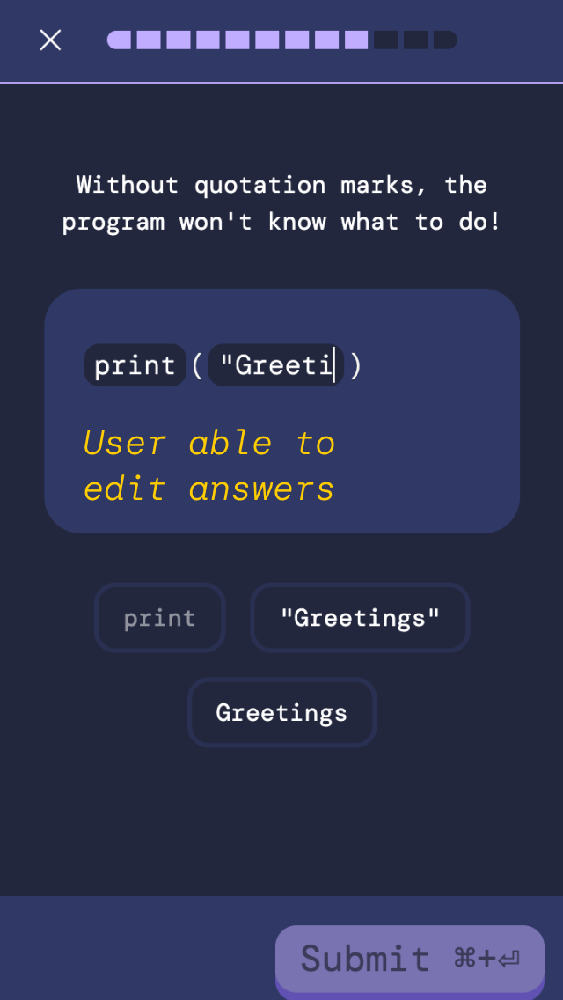
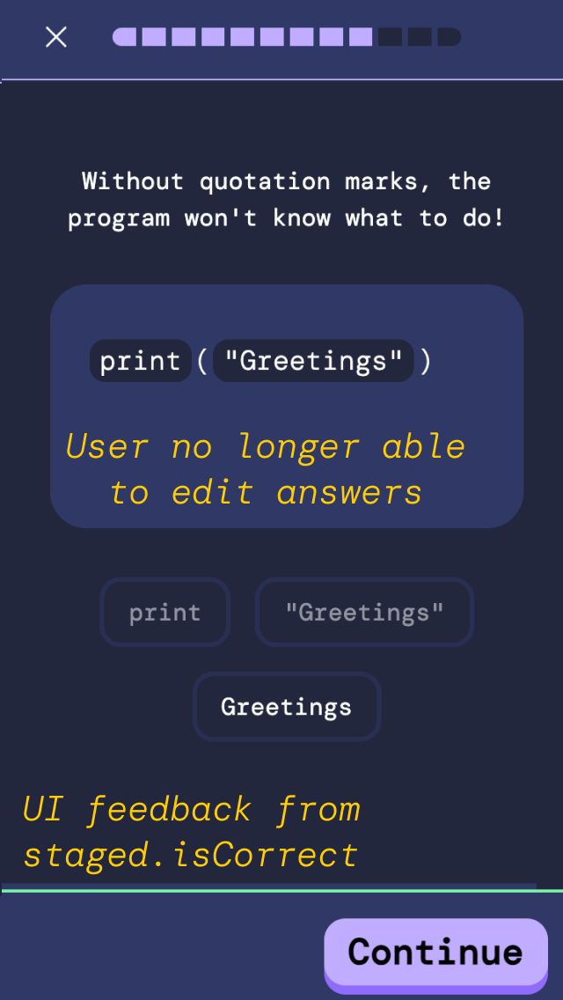

<h1 align="center">Lesson Flow</h1>

## Overview

The lesson flow manages how a user moves through a lesson’s exercises. It decides what’s unlocked, what gets stored, what counts as progress, and when the user is actually done.

It handles:

- exercise ordering
- locking and unlocking the next step
- submission lifecycle
- scoring and correctness checks

---

## The 3 Phases of an exercise

Each exercise in a lesson has 3 'phases' that it goes through.

<style>
  .lesson-phase-text-col {
    width: 480px;
  }

  .lesson-phase-img-col {
    width: 280px;
    display: flex;
    justify-content: center;
  }

  .lesson-phase-img {
    width: 100%;
    aspect-ratio: 9 / 16;
    object-fit: contain;
    border: 1px solid #ccc;
    border-radius: 6px;
  }

 .lesson-phase-row {
    display: flex;
    gap: 24px;
    align-items: flex-start;
  }
</style>

### 1. User Input Phase

<div class="lesson-phase-row">
  <div class="lesson-phase-text-col">

The user chooses options and messes around with answers here. Nothing is final yet. This is the phase where the user experiments with different answer selections and changes their mind freely without any consequences.

Answers are stored locally in a `useState` array of `AnswerToken`. The user can revise and adjust these selections however they like. Nothing is locked in at this stage.

The submit button remains disabled until there is at least a valid combination of tokens. Valid simply means the selection forms a structured choice that the system can evaluate. It does not imply correctness. The system just needs something coherent to process before allowing submission.

  </div>

  <div class="lesson-phase-img-col">
    
  </div>

</div>

---

### 2. Staged Phase

<div class="lesson-phase-row">
  <div class="lesson-phase-text-col">

Submit has been clicked.

User input is locked

State is pushed into the staging hook for correctness validation

Produces an `ExerciseAttempt` stored in `currentlyStagedAttempt`,
`currentlyStagedAttempt.isCorrect` drives the feedback UI

  </div>

  <div class="lesson-phase-img-col">
    
  </div>
  
</div>

---

### 3. Committed Phase

The user has seen feedback and clicked **Continue**.

- The staged attempt merges into `committedExerciseSubmissions`
- If the exercise was wrong: retry unlocked
- If correct: next exercise unlocked
- Once the final exercise is committed, all submissions roll up into a `LessonSubmissionType`

---

## After the Lesson


Once everything is done, the user is taken to a syncing screen. This is where we send the finalized `LessonSubmissionType` to the backend. Progress updates and streak calculations are performed and returned to the client.

After syncing, the user is taken to the lesson completion page where they are able to view their feedback.

If the users streak has finished, 

---

## Correctness Rules

Evaluating if an attempt is correct or not is done by sorting integers.

Each option has an `answerOrder`:

- distractor → `null`
- first answer → `1`
- second → `2`
- …

A submitted attempt is **correct** when the selected `answerOrder`s are strictly ascending:

```
[1, 2, 3, 4]   → correct
[1, 3, 2, 4]   → wrong
[1, null, 3, 4]   → wrong
```

Null means a distractor was picked, which automatically means the attempt is wrong.


---

