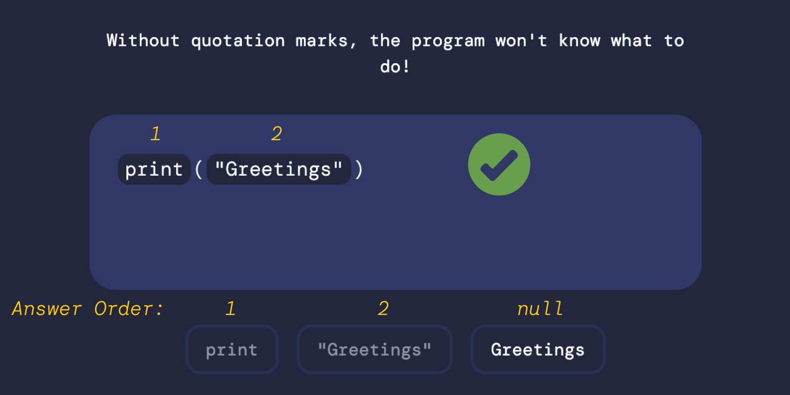
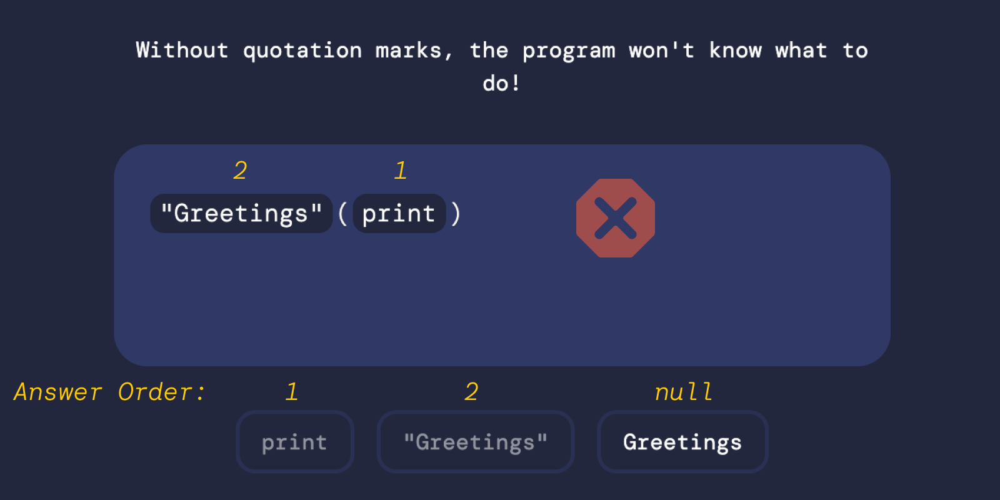

<h1 align="center">Lesson Flow</h1>

## Overview

The lesson flow manages how a user moves through a lesson’s exercises. It decides what’s unlocked, what gets stored, what counts as progress, and when the user is actually done.

It handles:

- exercise ordering
- locking and unlocking the next step
- submission lifecycle
- scoring and correctness checks

---

## The 3 Phases of an exercise

Each exercise in a lesson has 3 'phases' that it goes through.


### 1. User Input Phase

The user interacts with the exercise by selecting options and forming a potential answer. Nothing is evaluated, and no submission exists. This phase is purely about constructing input.

Selections are stored locally in a `useState` array of `AnswerToken`, allowing the user to revise, remove, or reorder choices without restrictions. No progress changes occur here.

The submit button stays disabled until the selection meets the basic requirements of a complete answer. Once the input satisfies those criteria, submission becomes available.

---

### 2. Staged Phase

The user has submitted their answer. Input is now locked, and the exercise goes from interaction to evaluation.

The current selection is passed into the staging hook, which generates an `ExerciseAttempt`. This object represents the submitted answer and is used to perform correctness checks.

The result of this attempt is stored in `currentlyStagedAttempt`. Its `isCorrect` property determines the feedback the user sees and whether they are allowed to continue or must retry.

---

### 3. Committed Phase

The user has seen feedback and clicked **Continue**.

- The staged attempt merges into `committedExerciseSubmissions`
- If the exercise was wrong: retry unlocked
- If correct: next exercise unlocked
- Once the final exercise is committed, all submissions roll up into a `LessonSubmissionType`

---

## After the Lesson


Once everything is done, the user is taken to a syncing screen. This is where we send the finalized `LessonSubmissionType` to the backend. Progress updates and streak calculations are performed and returned to the client.

After syncing, the user is taken to the lesson completion page where they are able to view their feedback.

If the users streak has finished, 

---

## Correctness Rules

Evaluating if an attempt is correct or not is done by sorting integers.

Each option has an `answerOrder`:

- distractor → `null`
- first answer → `1`
- second → `2`
- …

A submitted attempt is **correct** when the selected `answerOrder`s are strictly ascending:

```
[1, 2, 3, 4]   → correct
[1, 3, 2, 4]   → wrong
[1, null, 3, 4]   → wrong
```

Null means a distractor was picked, which automatically means the attempt is wrong.

### Correct Exercise Example: 


### Incorrect Exercise Example: 


---

